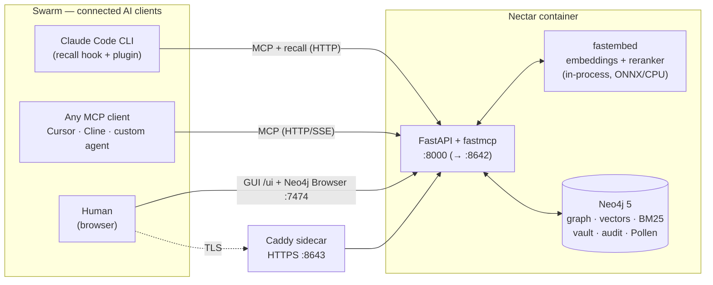
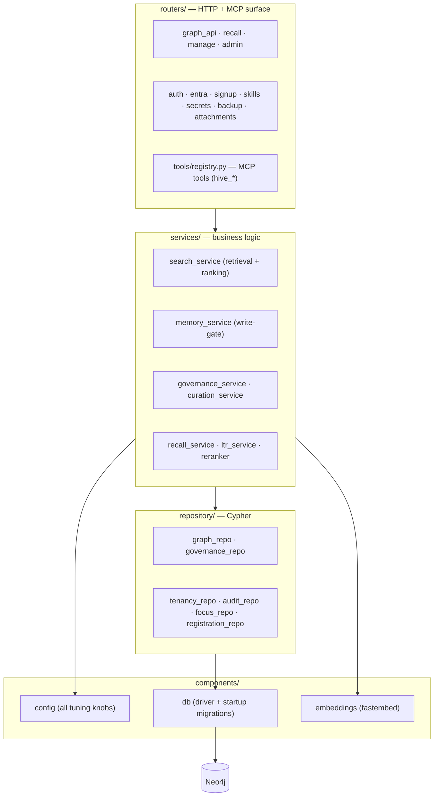
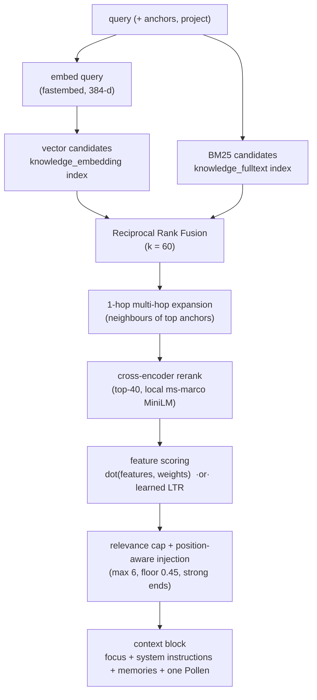
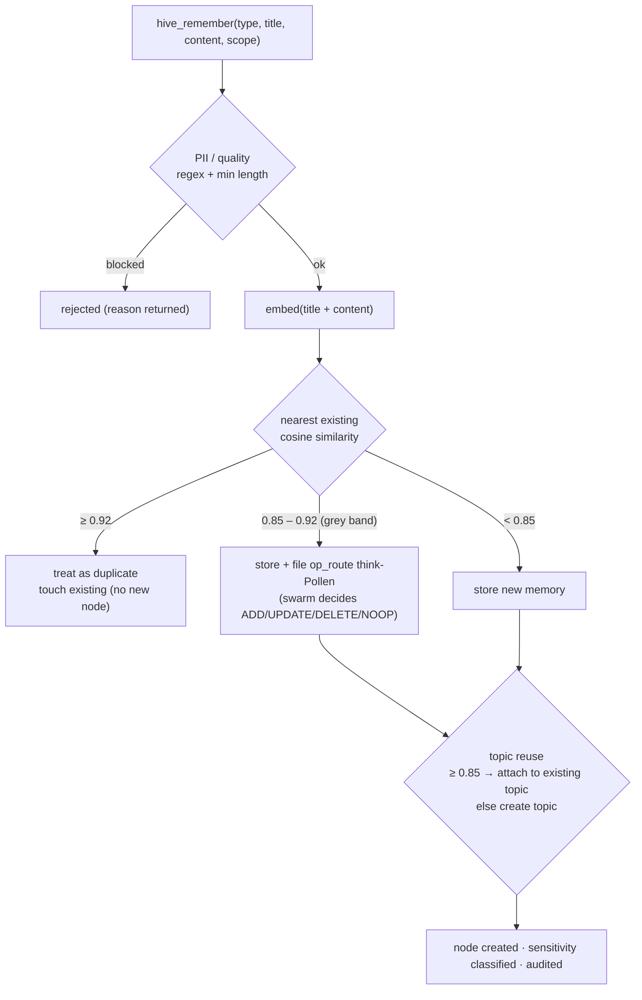
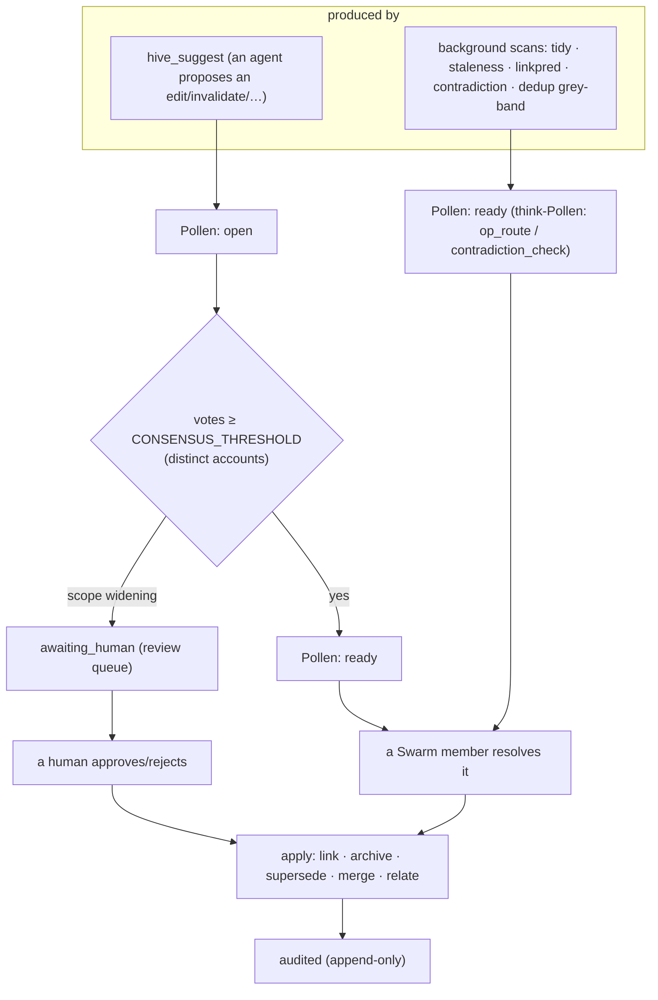
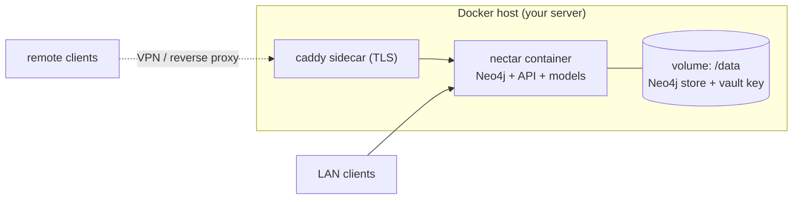

# Architecture

Nectar is one **stateful container**: a Neo4j 5 database, a FastAPI + fastmcp application, and small
local ML models (embeddings + reranker), all in a single image. There is no separate app tier, no
message bus, no external model service. That simplicity is deliberate — it makes the whole brain
trivially self-hostable and keeps every byte of data on your own machine.

- **Language/stack:** Python 3.12, FastAPI, [fastmcp](https://github.com/jlowin/fastmcp), Neo4j 5
  Community, [fastembed](https://github.com/qdrant/fastembed) (ONNX, CPU — no PyTorch).
- **Layering:** `routers/ → services/ → repository/ → components/` (HTTP/MCP surface → business
  logic → Cypher → cross-cutting config/db/embeddings).
- **Single store:** Neo4j holds *everything* — the knowledge graph, tenancy, the secrets vault,
  the audit trail, Pollen, plus a **native vector index** and a **BM25 full-text index**. No
  separate vector database.

---

## 1. System context

**Ports**

| Port | Surface | Notes |
|---|---|---|
| `8642` | HTTP API + MCP (`/mcp`) + GUI (`/ui`) | The one port clients use. (uvicorn listens on `8000` inside; mapped out as `8642`.) |
| `8643` | Same, over HTTPS | Optional Caddy sidecar terminating TLS (self-signed or real). For MCP clients that require TLS. |
| `7474` | Neo4j Browser | A window on the raw graph. **Do not expose publicly.** |
| `7687` | Bolt | Neo4j's binary protocol. Internal; open only to trusted tooling over a tunnel/VPN. |

---

## 2. Components inside the container

Startup runs **idempotent migrations** in `components/db.py`: it creates the `knowledge_uid`
constraint, the `knowledge_embedding` **vector index** (384-dim, cosine) and the
`knowledge_fulltext` **BM25 index**, and backfills legacy data (e.g. the Bloom lifecycle and the
`:Chore`→`:Pollen` relabel). Deploying is therefore just "ship code + restart" — no manual DB steps.

---

## 3. The read path — recall & retrieval

Every prompt triggers a deterministic recall. There is **no LLM in this path** — only a local
embedding model, a local cross-encoder, and arithmetic.

The scoring features and their weights (freshness/decay, Bloom, importance, Memory Worth, PageRank,
supersession penalty, anchor/decision/learning boosts) and the exact formulas are in
**[ML-AND-ALGORITHMS.md](ML-AND-ALGORITHMS.md)**.

---

## 4. The write path — the write-gate

New knowledge is written directly (agents are trusted to *add*), but a deterministic gate protects
quality and prevents sprawl. Editing *existing* knowledge is never direct — it is consensus-gated
(§5).

Thresholds (`DEDUP_SIMILARITY_THRESHOLD` 0.92, `DEDUP_REVIEW_THRESHOLD` 0.85,
`TOPIC_SIMILARITY_THRESHOLD` 0.85, `MIN_TITLE_LENGTH` 8, `MIN_CONTENT_LENGTH` 40) live in
`components/config.py` and are shown read-only in the GUI's **Beheer → Instellingen**.

---

## 5. Governance — how the Swarm maintains the Hive

Mutations to existing knowledge and structural upkeep flow through **Pollen** (small tasks). Two
kinds exist: **consensus Pollen** (a proposed change that needs independent votes) and
**think-Pollen** (a reasoning task the server hands to the Swarm).

Safeguards: consensus counts **distinct accounts** (correlation-aware); **scope-widening** always
escalates to a human; for a near-duplicate merge (`op_route`) the **producer ≠ reviewer** (you can't
rubber-stamp your own write); a claimed Pollen is hidden from other agents for `CLAIM_TTL_MIN`
minutes (stigmergy) so two agents don't do the same task.

---

## 6. Deployment topology (reference: own server)

The container is **stateful and single-writer** (Neo4j is embedded). This is the single most
important operational fact: **you run exactly one replica**, and the `/data` volume must persist.
The implications for Azure Container Apps and OpenShift/Kubernetes are covered in
**[DEPLOYMENT.md](DEPLOYMENT.md)**.

---

## 7. Design decisions worth knowing

- **Single container, single store.** Neo4j does graph + vectors + full-text + tenancy + vault +
  audit. One dependency to run and back up. Trade-off: no horizontal scale-out (see DEPLOYMENT).
- **Server stays LLM-free.** Embeddings and reranking are small local ONNX models; any real
  reasoning is delegated to the Swarm via think-Pollen. No prompt or memory is ever sent to a
  cloud LLM by the server itself.
- **Everything is bi-temporal & non-destructive.** Nothing is hard-deleted by the Swarm — memories
  are archived or superseded; the old truth stays findable but sinks in ranking.
- **Deterministic where it can be, delegated where it can't.** Detection (what *might* be a
  duplicate/contradiction/gap) is deterministic and cheap; *judgement* is the Swarm's.
