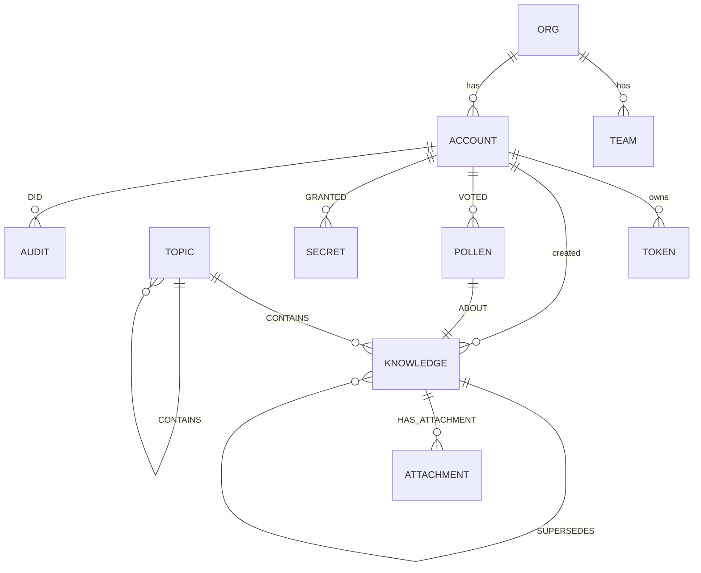

# Data Model (Graph Schema)

Everything lives in one Neo4j 5 database. Tenancy, knowledge, secrets, audit and Pollen are all
nodes and relationships in the same graph — scoping is enforced by properties on every query, not by
separate databases.

## Node labels

| Label | What it is | Key properties |
|---|---|---|
| `:Org` | a tenant organisation | `uid`, `name`, `consensus_threshold` |
| `:Team` | a team within an org | `uid`, `org_uid`, `name` |
| `:Account` | a machine/person identity | `uid`, `org_uid`, `team_uid`, `name`, `person`, `role` |
| `:Token` | an auth token (hashed) | `hash` (sha256), `label`, `role`, `created`, `last_used`, `expires_at`, `active` |
| `:Invite` | a self-registration code | `code_hash`, `role`, `uses_left`, `expires_at` |
| `:Knowledge` | **a memory** (+ a `type` label too) | `uid`, `org_uid`, `title`, `content`, `type`, `scope`, `embedding`, `created`, `created_by`, `created_by_model`, `use_count`, `lifecycle`, `importance`, `half_life_days`, `sensitivity`, `superseded_by`, `archived`, `system` |
| `:Topic` | a grouping node (DAG root layer) | `uid`, `org_uid`, `title`, `summary`, `embedding` |
| `:Skill` / `:Workflow` | file-backed knowledge units | as `:Knowledge` + attached `:File`s |
| `:Pollen` | a maintenance task (was `:Chore`) | `uid`, `org_uid`, `type`, `status`, `mode`, `payload`, `created`, `resolved`, `resolved_by`, `resolution`, `suggestion_key` |
| `:Attachment` / `:File` | binary/text attached to a node | `uid`, `filename`, bytes/content |
| `:Secret` | a Fernet-encrypted vault entry | `name`, `org_uid`, ciphertext, grants |
| `:Audit` | an append-only event | `uid`, `org_uid`, `action`, `target`, `detail`, `at` |
| `:Gap` | a repeated empty recall | `query`, `count`, `last` |
| `:HiveFocus` | per-account/project steering state | `goal`, `steps`, `guardrails`, `done_when`, `project`, `notes` |

**Memory `type`** (also applied as a second label): `memory`, `process`, `workflow`, `skill`,
`convention`, `decision`, `glossary`, `learning`, plus `topic`.

**Memory `scope`**: `org` (whole org) · `team` (one team) · `account` (personal). Every read applies
a `VISIBLE` predicate so an account only ever sees what its scope allows.

**Bloom `lifecycle`**: `captured` → `validated` → `mature` → `deprecated`.

## Relationships

| Type | From → To | Meaning |
|---|---|---|
| `CONTAINS` | `:Topic` → `:Knowledge`/`:Topic` | topic membership (multi-parent DAG) |
| `RELATES` | `:Knowledge` ↔ `:Knowledge` | "related to" (from link prediction / `hive_relate`) |
| `SUPERSEDES` | `:Knowledge(new)` → `:Knowledge(old)` | bi-temporal supersession |
| `ABOUT` | `:Pollen` → `:Knowledge` | which memory a task concerns |
| `VOTED` | `:Account` → `:Pollen` | a consensus vote |
| `HAS_ATTACHMENT` / `HAS_FILE` | `:Knowledge` → `:Attachment`/`:File` | attachments / skill files |
| `HAS_TOKEN` | `:Account` → `:Token` | token ownership |
| `OWNS` / `IN_ORG` / `IN_TEAM` | tenancy edges | org/team membership |
| `GRANTED` | `:Account` → `:Secret` | per-secret access grant |
| `DID` | `:Account` → `:Audit` | who did an audited action |

## Indexes & constraints (created idempotently at startup)

| Name | Kind | On |
|---|---|---|
| `knowledge_uid` | uniqueness constraint | `:Knowledge(uid)` |
| `knowledge_embedding` | **vector index** (384-d, cosine) | `:Knowledge(embedding)` |
| `knowledge_fulltext` | **full-text (BM25)** | `:Knowledge(title, content)` |

## Schema diagram

> Multi-parent is intentional: a memory can hang under several topics (e.g. a deploy workflow under
> both "Deploy" and a specific client topic). The topic layer is a DAG, not a tree.
