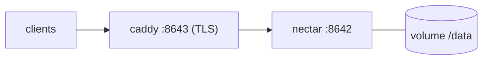

# Deployment

Nectar ships as **one stateful container** (Neo4j + API + local models). The single fact that drives
every deployment choice:

> **It is single-writer and stateful.** Run **exactly one replica**, give it a **persistent volume**
> for `/data`, and never let two instances share that volume. There is no horizontal scale-out —
> Neo4j Community is embedded and owns the store. Scale *up* (CPU/RAM), not *out*.

Minimum sizing: ~**2 vCPU / 4 GB RAM** (Neo4j heap + page cache + the ONNX models). The embedding
model is baked into the image, so cold start is fast and fully offline.

## Configuration (all targets)

Provided as environment variables; a `.env` file works for Compose.

| Var | Required | Meaning |
|---|---|---|
| `NEO4J_PASSWORD` | ✅ | the graph store password |
| `HIVE_ORG_NAME` | – | name of the org the first sign-up creates |
| `SECRET_MASTER_KEY` | – | Fernet key for the vault; **auto-generated + persisted to the volume if empty** (back it up) |
| `CONSENSUS_THRESHOLD` | – | independent votes before a change applies (set `1` for solo/small) |
| `RERANK_ENABLED` | – | local cross-encoder on/off (default on) |
| `EMBEDDINGS_*` | – | embedding model config (local by default) |
| `ENTRA_*`, `PUBLIC_BASE_URL` | – | optional Microsoft SSO |
| `ADMIN_TOKEN` | – | operator break-glass for `/admin`; empty **disables** that API |

See **[SECURITY.md](SECURITY.md)** for the security-relevant ones and
**[ML-AND-ALGORITHMS.md](ML-AND-ALGORITHMS.md)** for the tuning knobs.

---

## Option A — Own server (Docker Compose)  ·  *the house style, recommended*

The natural fit: one host, one volume, optional TLS sidecar.

```bash
cp server/.env.example .env          # set NEO4J_PASSWORD (required)
docker compose up -d --build
open http://localhost:8642/ui        # first account becomes org_admin
```

- **Persistence:** the compose file mounts a named volume at Neo4j's `/data`. Back it up (see
  OPERATIONS) — it holds the graph *and* the vault key.
- **TLS:** an optional Caddy sidecar terminates HTTPS on `:8643` (self-signed by default; point it
  at a real cert for production). MCP clients that require TLS use `:8643`.
- **Remote access:** put it behind a reverse proxy with a real cert, or a VPN tunnel — do
  **not** expose `7474`/`7687` publicly.
- **Updates:** `rsync` the code (or pull) and `docker compose up -d --build`. Migrations run
  idempotently on startup — no manual DB steps.



---

## Option B — Azure Container Apps (ACA)

ACA works, but it is built for *stateless, scale-to-zero* services — the opposite of Nectar. Make it
behave:

- **One replica, always on:** `--min-replicas 1 --max-replicas 1`. Scaling past 1 replica corrupts
  the store (two Neo4j writers). Disable scale-to-zero.
- **Persistent storage is mandatory:** ACA's container filesystem is **ephemeral** — without a
  mounted volume you lose the whole graph on every restart. Mount an **Azure Files** share at
  Neo4j's `/data` via an ACA storage mount. (Azure Files SMB latency is higher than local disk;
  acceptable for this workload, but size RAM generously for page cache.)
- **Ingress:** external ingress → target port **8642**. ACA gives you TLS + a FQDN, so you don't
  need the Caddy sidecar; set `PUBLIC_BASE_URL` to the ACA FQDN (also your Entra redirect base).
- **Secrets:** `NEO4J_PASSWORD`, `SECRET_MASTER_KEY`, `ENTRA_*` as ACA **secrets** (not plain env).
  Set `SECRET_MASTER_KEY` explicitly (don't rely on auto-gen — a replacement replica must decrypt
  the existing vault).
- **Neo4j Browser / Bolt:** don't expose `7474`/`7687` — ACA single-port ingress already hides them;
  reach them via `az containerapp exec` if needed.

```bash
az containerapp create -n nectar -g <rg> --environment <env> \
  --image <registry>/hivemind:latest \
  --min-replicas 1 --max-replicas 1 \
  --ingress external --target-port 8642 \
  --secrets neo4jpw=... masterkey=... \
  --env-vars NEO4J_PASSWORD=secretref:neo4jpw SECRET_MASTER_KEY=secretref:masterkey HIVE_ORG_NAME=...
# then attach an Azure Files mount at /data (az containerapp env storage set + a volume mount)
```

**When ACA is a poor fit:** if you want true HA/failover. Neo4j Community can't cluster; for that
you'd move to Neo4j Enterprise (causal cluster) — out of scope for the single-container design.

---

## Option C — OpenShift / Kubernetes

A single stateful workload: `StatefulSet` (or `Deployment` with `Recreate`), one PVC, a Service, a
Route/Ingress.

- **Exactly one pod:** `replicas: 1`. Use **`strategy: Recreate`** (or a StatefulSet) — a
  `RollingUpdate` would briefly run two pods against the same PVC and corrupt Neo4j.
- **Storage:** a `ReadWriteOnce` PVC mounted at `/data`. RWO is fine *because* there's only ever one
  pod.
- **OpenShift SCC / non-root:** the `restricted` SCC runs the container with a random high UID.
  Neo4j's directories must be group-writable; set `securityContext.fsGroup` so the mounted volume is
  group-owned, and ensure the image doesn't require a fixed UID. If the neo4j base image needs its
  own UID, grant the `anyuid` SCC to the service account (least-privilege: only if `fsGroup` isn't
  enough).
- **Probes:** `readinessProbe`/`livenessProbe` → `GET /health` on 8642. Give a generous
  `initialDelaySeconds` (Neo4j + model load on cold start).
- **Resources:** requests/limits ~`2 CPU / 4Gi`. Set Neo4j heap/pagecache env if you tune it.
- **Ingress:** an OpenShift `Route` (edge/reencrypt TLS) or a K8s `Ingress` → Service port 8642.
- **Secrets/config:** `NEO4J_PASSWORD`, `SECRET_MASTER_KEY`, `ENTRA_*` from a `Secret`; the rest
  from a `ConfigMap`.

```yaml
# sketch — one stateful pod, one PVC
apiVersion: apps/v1
kind: Deployment
metadata: { name: nectar }
spec:
  replicas: 1
  strategy: { type: Recreate }          # never two pods on the same PVC
  template:
    spec:
      securityContext: { fsGroup: 7474 } # make /data group-writable for the random UID
      containers:
        - name: nectar
          image: <registry>/hivemind:latest
          ports: [{ containerPort: 8642 }]
          envFrom: [{ secretRef: { name: nectar-secrets } }, { configMapRef: { name: nectar-config } }]
          readinessProbe: { httpGet: { path: /health, port: 8642 }, initialDelaySeconds: 40 }
          volumeMounts: [{ name: data, mountPath: /data }]
      volumes: [{ name: data, persistentVolumeClaim: { claimName: nectar-data } }]
```

---

## Choosing

| | Own server (Compose) | Azure Container Apps | OpenShift / K8s |
|---|---|---|---|
| Best for | self-host, full control, lowest latency | managed, no VM to babysit, in Azure already | you already run OpenShift/K8s |
| Persistence | local volume (fast) | Azure Files mount (**required**) | RWO PVC |
| Replicas | 1 | 1 (min=max=1) | 1 (`Recreate`/StatefulSet) |
| TLS | Caddy sidecar / proxy | built-in ingress | Route/Ingress |
| Gotcha | back up the volume + master key | ephemeral FS by default; pin master key | SCC/non-root, `Recreate` strategy |

Whatever the target: **one replica, one persistent `/data`, back up the volume and the
`SECRET_MASTER_KEY`.** Everything else is detail.
